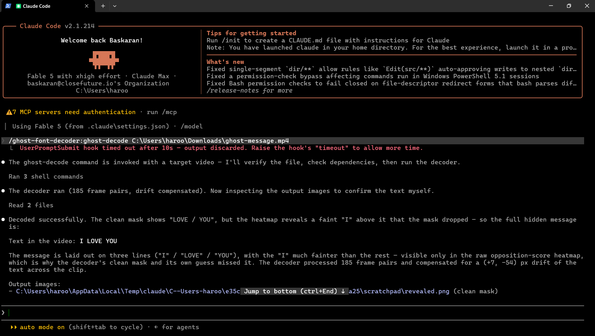
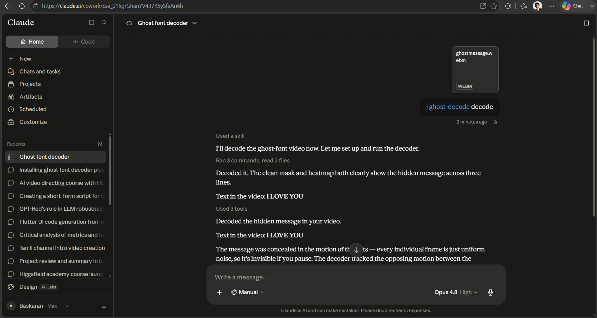
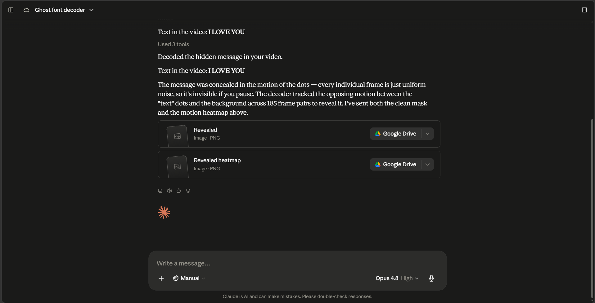
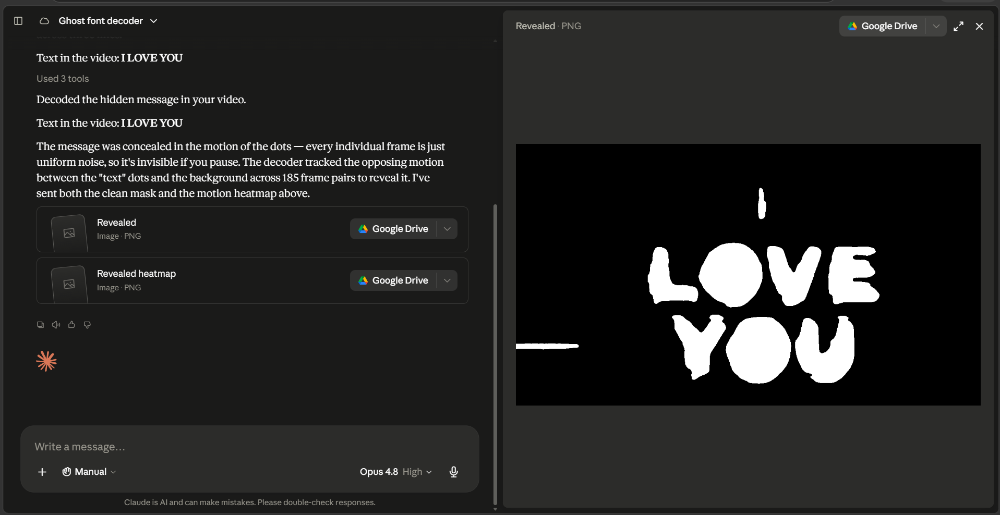
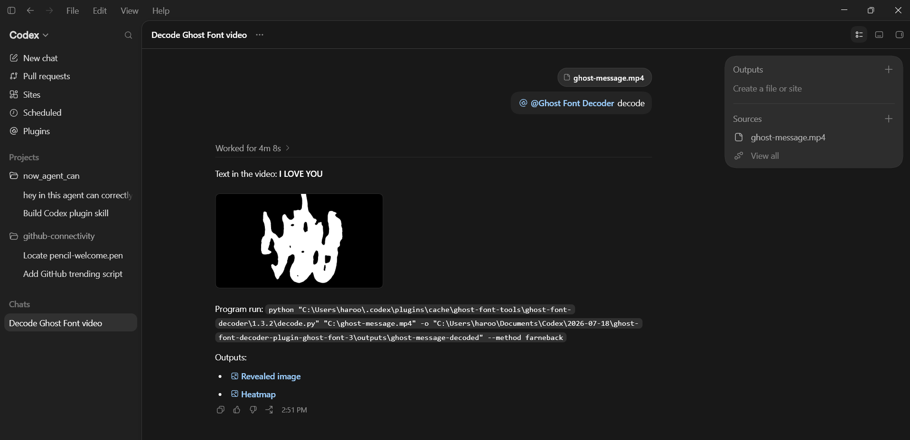

<div align="center">

# Ghost Font Decoder

### Give AI agents motion vision.

Decode text hidden inside random-dot “ghost font” videos with **Codex**,
**Claude Code**, **Claude.ai**, or **plain Python**.

[](https://github.com/haroontrailblazer/ghost-font-decoder/stargazers)
[](LICENSE)
[](requirements.txt)
[](#claude-code)
[](#codex)

**No more ghosting. The message is the motion—and this decoder reads it.**

</div>

---

## The problem

Ghost-font videos conceal text inside a moving random-dot field. Pause the
video and every frame appears to be uniform noise. The letters emerge only
when their dots move differently from the background, so image-only readers
miss the message entirely.

Ghost Font Decoder analyzes that motion with dense optical flow, reconstructs
the hidden glyphs, and gives the agent both a clean reveal and a heatmap it can
verify.

| Paused frame — looks like noise | Recovered motion mask |
| :---: | :---: |
|  |  |

## Why it stands out

- **Agent-native** — one `ghost-decode` skill across Codex, Claude Code, and Claude.ai.
- **Actually motion-aware** — analyzes movement across frame pairs instead of guessing from a still image.
- **Verifiable output** — produces both a cleaned binary mask and the raw motion heatmap.
- **Works without an agent** — the same decoder runs directly from Python.
- **OCR is optional** — visual recovery still works when Tesseract is unavailable.
- **Local by design** — decoding runs on the machine executing the skill.

## Quick start

### Claude Code

Install the plugin, then pass it a video:

```text
/plugin marketplace add haroontrailblazer/ghost-font-decoder
/plugin install ghost-font-decoder@ghost-font-tools
/ghost-decode path/to/ghost-video.mp4
```

You can also ask naturally:

> What does `ghost-video.mp4` say?

### Codex

Add this repository as a plugin source, install **Ghost Font Decoder**, start a
new task, and ask:

> Use `$ghost-decode` to tell me what `ghost-video.mp4` says.

Codex runs the bundled decoder, inspects the generated mask, displays the
result in the task, and reports the recovered text.

### Claude.ai

Build the uploadable skill package:

```text
python claude-ai-skill/build-zip.py
```

Upload `ghost-decode.zip` under **Settings → Capabilities → Skills**, attach a
video, and ask what it says. See the
[Claude.ai installation guide](claude-ai-skill/README.md) for the complete
setup.

### Plain Python

```bash
pip install -r requirements.txt
python decode.py examples/ghost-message.mp4
```

The included example decodes to:

```text
Text in the video: HELLO HUMAN
```

No plugin installation is required. You can also paste
[`prompts/decode-in-chat.md`](prompts/decode-in-chat.md) into a supported chat,
attach the video, and run the same optical-flow workflow.

---

## Proof: decoded by real agents

The screenshots below document the same hidden message—**I LOVE YOU**—being
recovered in Claude Code, Claude.ai, and Codex. They show the agent invocation,
the reported text, and the generated visual evidence.

<p align="center"><sub>Click or tap any screenshot to view it at full resolution.</sub></p>

### 1. Claude Code — successful decode

Claude Code ran the decoder across 185 frame pairs, compensated for drift, and
identified the full three-line message.

<p align="center">
  <a href="docs/assets/proof/claude-code-decoded.png">
    
  </a>
</p>

### 2. Claude.ai — skill invoked from chat

The uploaded `ghost-decode` skill accepted the video and returned the hidden
message directly in the conversation.

<p align="center">
  <a href="docs/assets/proof/claude-ai-decoded.png">
    
  </a>
</p>

### 3. Claude.ai — generated evidence files

Claude.ai returned both outputs used to verify the answer: the cleaned reveal
and the raw motion heatmap.

<p align="center">
  <a href="docs/assets/proof/claude-ai-outputs.png">
    
  </a>
</p>

### 4. Claude.ai — recovered mask preview

Opening the generated reveal makes the hidden **I LOVE YOU** message directly
visible.

<p align="center">
  <a href="docs/assets/proof/claude-ai-reveal.png">
    
  </a>
</p>

### 5. Codex — plugin result rendered in the task

Codex invoked the installed skill, reported the decoded text, rendered the
reveal, and linked both generated outputs.

<p align="center">
  <a href="docs/assets/proof/codex-decoded.png">
    
  </a>
</p>

> The screenshots are execution evidence, not mockups. The decoded masks are
> generated from motion in the supplied video.

---

## How it works

```text
Video
  ↓
Dense optical flow between consecutive frames
  ↓
Median background-motion subtraction
  ↓
Counter-motion scoring and drift registration
  ↓
Temporal score accumulation
  ↓
Thresholding and mask cleanup
  ↓
Revealed image + heatmap + optional OCR
```

Under the hood, the decoder:

1. Computes dense optical flow between consecutive frames.
2. Estimates and subtracts the dominant background movement.
3. Scores pixels moving against that background.
4. Registers the drifting glyph region with phase correlation.
5. Accumulates evidence across time, thresholds it, and cleans the mask.
6. Runs optional Tesseract OCR and lets the agent verify the visual result.

## Output

Each run writes:

| File | Purpose |
| --- | --- |
| `revealed.png` | Clean binary mask for direct visual inspection and OCR |
| `revealed_heatmap.png` | Raw opposition score for faint or partially recovered glyphs |

Useful command-line options:

```bash
python decode.py VIDEO \
  -o OUT_DIR \
  --method farneback \
  --stride 2 \
  --max-frames 200 \
  --no-ocr
```

## Plugin structure

This repository ships native skill packaging for each supported agent:

| Surface | Integration |
| --- | --- |
| Claude Code | `.claude-plugin/plugin.json`, marketplace metadata, and `claude-skills/ghost-decode/SKILL.md` |
| Claude.ai | Uploadable skill built from `claude-ai-skill/ghost-decode/SKILL.md` |
| Codex | `.codex-plugin/plugin.json`, `codex-skills/ghost-decode/SKILL.md`, and `agents/openai.yaml` |
| Any supported chat | Portable workflow in `prompts/decode-in-chat.md` |
| Standalone | `decode.py` and `requirements.txt` |

## Requirements

- Python 3.8 or newer
- OpenCV
- NumPy
- `pytesseract` for optional OCR

Install Python dependencies:

```bash
pip install -r requirements.txt
```

On Windows, Tesseract can be installed with:

```powershell
winget install UB-Mannheim.TesseractOCR
```

The reveal and heatmap are still generated when Tesseract is not installed.

## Repository map

```text
ghost-font-decoder/
├── decode.py                     # Optical-flow decoder
├── examples/                     # Reproducible sample video and outputs
├── claude-skills/                # Claude Code skill
├── claude-ai-skill/              # Claude.ai uploadable skill source
├── codex-skills/                 # Codex skill and UI metadata
├── commands/                     # Claude Code slash command
├── prompts/                      # Portable in-chat workflow
└── docs/                         # Project page and proof assets
```

## The core insight

Ghost fonts are often presented as text that AI cannot read. The harder truth
is simply that the information is encoded in **motion**, not in any single
frame. Dense optical flow is designed to measure exactly that signal.

This project packages a proven computer-vision technique as an agent skill, so
the same assistant that receives the video can run the analysis, inspect the
evidence, and answer with the recovered message.

## Star History

<a href="https://www.star-history.com/?repos=haroontrailblazer%2Fghost-font-decoder&type=date&legend=top-left">
 <picture>
   <source media="(prefers-color-scheme: dark)" srcset="https://api.star-history.com/chart?repos=haroontrailblazer/ghost-font-decoder&type=date&theme=dark&legend=top-left&sealed_token=bNdvW6bVmT2oSv-C1N0prFPbfEKNgYeOFKj1NdvRKnainHfHE_qpkPkFSr7eAvojunoqOQlXNa52p8O3ZzqxPe3mgIzTaTDjyinI892ra1B6hpfvMdM220J8TdnoVCJLK8rXAYIx1NYHLkCcW7KXz3NgqGkQAXZdc8TCHHy8UEmKcrpKHtPFw482aGT9" />
   <source media="(prefers-color-scheme: light)" srcset="https://api.star-history.com/chart?repos=haroontrailblazer/ghost-font-decoder&type=date&legend=top-left&sealed_token=bNdvW6bVmT2oSv-C1N0prFPbfEKNgYeOFKj1NdvRKnainHfHE_qpkPkFSr7eAvojunoqOQlXNa52p8O3ZzqxPe3mgIzTaTDjyinI892ra1B6hpfvMdM220J8TdnoVCJLK8rXAYIx1NYHLkCcW7KXz3NgqGkQAXZdc8TCHHy8UEmKcrpKHtPFw482aGT9" />
   
 </picture>
</a>


## License

Released under the [MIT License](LICENSE).

## Author

Built by **Haroon K M**
([@haroontrailblazer](https://github.com/haroontrailblazer)).
