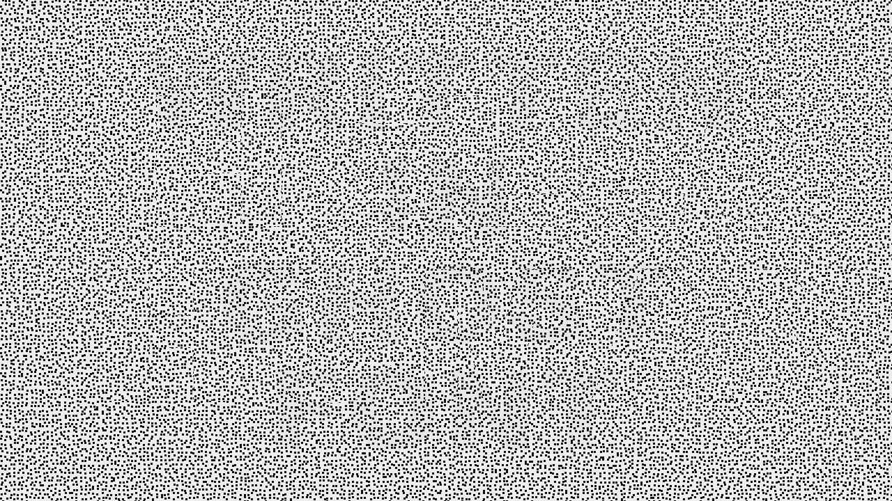
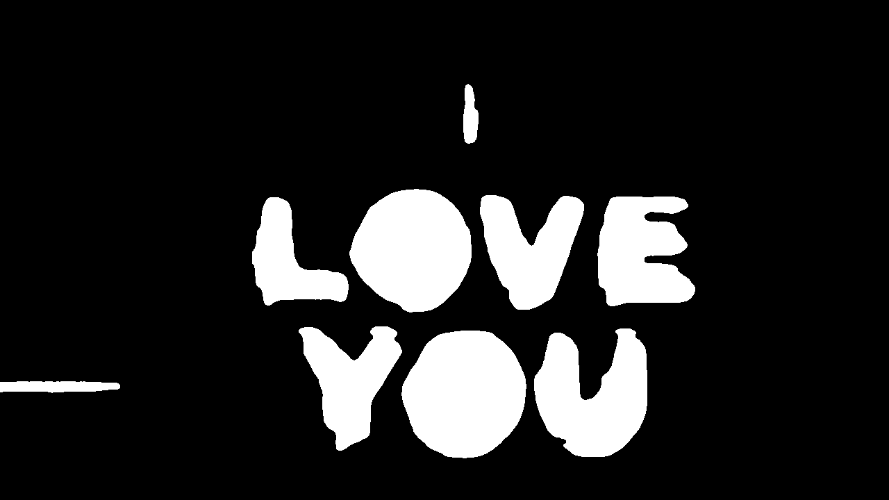

# Ghost Font Decoder

**No more ghosting.** Reveal the text hidden inside "ghost font" videos — with Codex, Claude Code, or plain Python.

[](https://github.com/haroontrailblazer/ghost-font-decoder/stargazers)
[](LICENSE)
[](requirements.txt)
[](#use-with-claude-code)
[](#use-with-codex)

"Ghost font" videos hide text in a random-dot field. A paused frame looks like
uniform noise, but dots inside the letter shapes move against the background,
making the message visible only during playback — invisible to anything that
reads video frame by frame.

The trick has one weakness: **the message *is* the motion.** This decoder reads
the motion directly with dense optical flow and tells you what the video says.

| Paused frame — what a frame-by-frame reader sees | Decoded with optical flow |
| :---: | :---: |
|  |  |

## Quick start

**Claude Code** — two commands, then just ask:

```text
/plugin marketplace add haroontrailblazer/ghost-font-decoder
/plugin install ghost-font-decoder@ghost-font-tools
```

> what does ghost-video.mp4 say?

**Codex** — add this repo as a plugin source, install `ghost-font-decoder`, then:

> Use $ghost-decode to tell me what ghost-video.mp4 says.

**Plain Python** — no AI required:

```text
pip install -r requirements.txt
python decode.py examples/ghost-message.mp4     # prints: HELLO HUMAN
```

## One repo, two plugins

Each tool gets a skill written for its own conventions — neither sees the other's:

| Tool | Manifest | Skill |
| --- | --- | --- |
| Claude Code | `.claude-plugin/plugin.json` + `marketplace.json` | `claude-skills/ghost-decode/SKILL.md` |
| Codex | `.codex-plugin/plugin.json` | `codex-skills/ghost-decode/SKILL.md` + `agents/openai.yaml` |

## Use with Codex

The repository is a Codex plugin root:

- `.codex-plugin/plugin.json` contains the Codex plugin manifest and UI metadata,
  pointing at `codex-skills/`.
- `codex-skills/ghost-decode/SKILL.md` contains the skill workflow.
- `codex-skills/ghost-decode/agents/openai.yaml` contains the skill's Codex UI metadata.

Add this repository as a local plugin source in a Codex marketplace, install
`ghost-font-decoder`, and start a new task so Codex loads the skill. Then ask:

> Use $ghost-decode to tell me what ghost-video.mp4 says.

Codex runs the bundled decoder, checks the revealed mask, and reports the hidden
text.

## Use with Claude Code

Claude Code loads its own skill from `claude-skills/` via `.claude-plugin`:

```text
/plugin marketplace add haroontrailblazer/ghost-font-decoder
/plugin install ghost-font-decoder@ghost-font-tools
```

Then ask:

> What does ghost-video.mp4 say?

or invoke the skill directly:

```text
/ghost-decode path/to/video.mp4
```

## Requirements

Install Python 3 dependencies with:

```text
pip install -r requirements.txt
```

Tesseract is optional. On Windows it can be installed with:

```text
winget install UB-Mannheim.TesseractOCR
```

Without Tesseract, the plugin still produces images that Codex or Claude can
inspect visually.

## Standalone use

```text
python decode.py examples/ghost-message.mp4
```

The command writes:

- `revealed_heatmap.png` — raw opposition score
- `revealed.png` — cleaned binary mask

Useful options:

```text
python decode.py VIDEO -o OUT_DIR --method farneback --stride 2 --max-frames 200 --no-ocr
```

## How it works

1. Compute dense optical flow between consecutive frames.
2. Subtract median background flow and score counter-moving pixels.
3. Register the drifting glyph region with phase correlation.
4. Accumulate scores, threshold them, and clean the mask.
5. Run optional Tesseract OCR and verify the result against the reveal.

The included example (`examples/ghost-message.mp4`) decodes to `HELLO HUMAN`.

## Star history

[](https://star-history.com/#haroontrailblazer/ghost-font-decoder&Date)

If you find this project useful, consider starring the repository to help others discover it.

## Author

Made by **Haroon K M** ([@haroontrailblazer](https://github.com/haroontrailblazer)) — MIT licensed.
